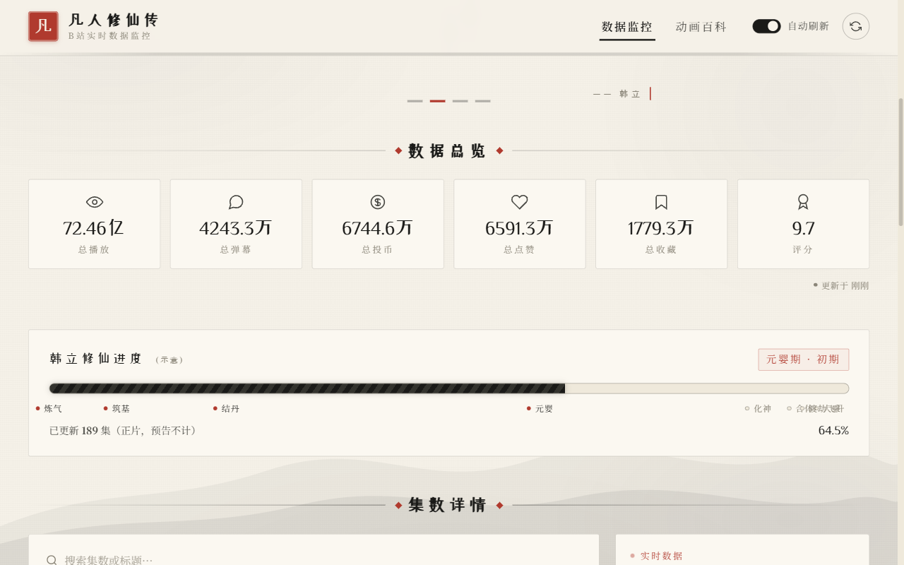
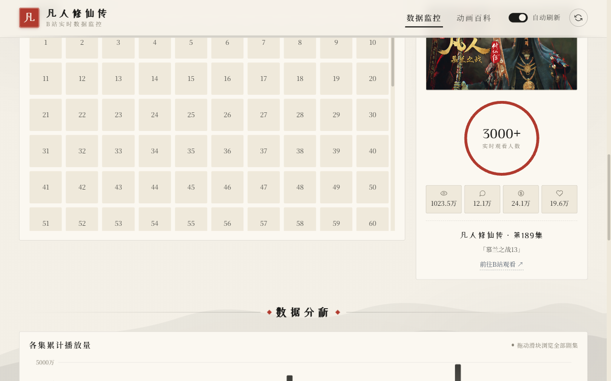
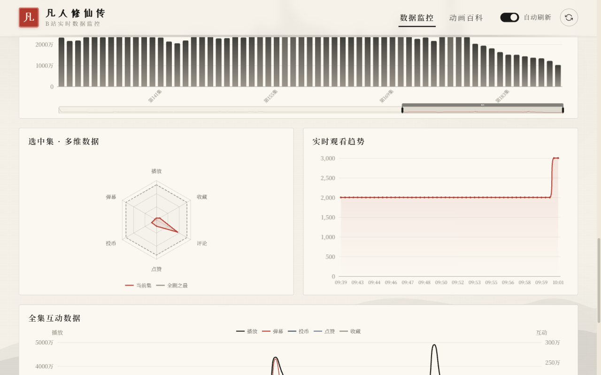

# 凡人修仙传 B站实时数据监控

实时监控《凡人修仙传》动画在 Bilibili 的播放数据，包括在线人数、播放量、弹幕数、点赞、收藏等多维度统计，并提供可视化趋势图与雷达图。

> 凡人修仙，仙路崎岖。一个普通的山村穷小子，偶然之下跨入到一个江湖小门派，虽然天资平庸，但依靠自身努力和合理处世，步步为营，最终修炼成仙。

## 页面预览

### 首页 — 韩立仙途


### 数据总览


### 集数列表 & 实时数据


### 数据分析（趋势图 & 雷达图）


### 动画百科


## 功能特性

### 数据监控
- **实时在线人数** — 每 20 秒刷新当前在线观看人数
- **播放/弹幕/点赞/收藏** — 单集详细统计数据
- **批量统计** — 并发线程同时获取多集数据，加速页面加载
- **趋势采样** — 后台每 60 秒自动采样，绘制在线人数变化曲线

### 可视化展示
- **ECharts 趋势图** — 实时在线人数随时间变化的折线图
- **雷达图** — 多维度对比当前集与全剧峰值（播放/弹幕/点赞/收藏/分享/评论）
- **面包屑导航** — 季 → 集 → 详情三级导航
- **图片懒加载** — Intersection Observer 实现剧照按需加载
- **名句轮播** — 韩立经典台词滚动展示

### 技术亮点
- **WBI 签名** — 实现 Bilibili API 的 WBI 签名鉴权
- **防抖落盘** — 2 秒防抖避免高频写盘，数据定时持久化
- **图片代理** — 代理 B 站图片请求，7 天缓存避免重复下载
- **内存缓存** — TTL 过期机制，平衡数据新鲜度与请求频率

## 快速启动

### 环境要求
- Python 3.8+
- pip

### 安装依赖

```bash
pip install -r requirements.txt
```

### 启动服务

```bash
python app.py
```

浏览器访问 http://localhost:5000

### 后台运行（Windows）

```powershell
Start-Process -FilePath "python" -ArgumentList "app.py" -WindowStyle Hidden
```

### 后台运行（Linux/macOS）

```bash
nohup python app.py > /dev/null 2>&1 &
```

## 配置项

| 环境变量 | 默认值 | 说明 |
|---------|--------|------|
| `FM_HOST` | `127.0.0.1` | 监听地址 |
| `FM_PORT` | `5000` | 监听端口 |
| `FM_DEBUG` | `0` | 调试模式（设为 `1` 开启） |

## API 接口

| 接口 | 方法 | 参数 | 说明 |
|------|------|------|------|
| `/api/seasons` | GET | — | 获取番剧季列表 |
| `/api/episodes` | GET | — | 获取所有集信息 |
| `/api/realtime` | GET | `aid`, `cid` | 获取单集实时在线人数 |
| `/api/overview` | GET | — | 获取番剧总览数据 |
| `/api/trend` | GET | `aid` | 获取单集在线人数趋势 |
| `/api/episode_stat` | GET | `aid` | 获取单集统计（播放/弹幕/点赞等） |
| `/api/episode_stats_batch` | GET | `aids` | 批量获取多集统计（逗号分隔） |
| `/img_proxy` | GET | `url` | B站图片代理（7 天缓存） |

所有接口返回 JSON 格式：
```json
{
  "code": 0,
  "data": { ... }
}
```

## 项目结构

```
fanren_monitor/
├── app.py              # Flask 主应用（路由 + 启动）
├── bilibili_api.py     # B站 API 封装（WBI 签名、番剧信息、实时人数）
├── cache_store.py      # 缓存存储层（JSON 持久化 + TTL 管理）
├── config.py           # 全局配置（端口、缓存 TTL、并发数等）
├── img_cache.py        # 图片缓存（磁盘缓存 + 大小上限清理）
├── sampler.py          # 后台定时采样器
├── requirements.txt    # Python 依赖
├── templates/
│   ├── base.html       # 基础模板
│   ├── index.html      # 首页（数据监控面板）
│   └── wiki.html       # 百科页
├── static/
│   ├── css/            # 样式文件
│   ├── js/             # 前端逻辑（index.js / wiki.js）
│   ├── images/         # 静态图片
│   └── vendor/         # 第三方库（ECharts）
└── data/               # 运行时数据（缓存、图片缓存）
```

## 技术栈

| 层级 | 技术 |
|------|------|
| 后端 | Python / Flask |
| 前端 | 原生 JavaScript / HTML / CSS |
| 图表 | Apache ECharts |
| 数据源 | Bilibili API（WBI 签名鉴权） |
| 存储 | JSON 文件持久化 + 内存 TTL 缓存 |
| 图片 | 自建代理 + 磁盘缓存（LRU 清理） |

## License

MIT
